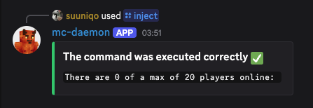

# mc-daemon
Enhance the experience of managing a self-hosted Minecraft server.

## What is mc-daemon?
`mc-daemon` is a highly extensible service designed to improve the experience of both administrators managing the server, and players interacting with it.

It's features are organized in two main layers:
- **Embedded Layer**: Automates routine tasks such as detecting server crashes and shutting down the server when it's empty for a while.
- **Discord Integration Layer**: Provides both players and admins with a suit of convenient slash commands for seamlessly managing the server from Discord, as well as event logging on text channels.

For instance, instead of having to manually open the server each time a player wants to join, users can simply use the `/start` command on Discord to open the server themselves.

With the use of dependency injection and an event-driven architecture, implementing new features, adding new slash commands, or even adapting the project to another game is really straightforward. Feel free to fork the project and customize it to your needs.


## Table of Contents
- [Features](#features)
- [Requirements](#requirements)
- [Setup](#setup)
- [Configuration](#configuration)
- [Troubleshooting](#troubleshooting)


## Features
This section provides a detailed overview of the app's functionalities

### Embedded Layer
This layer is responsible for directly managing and controlling the Minecraft server instance.

It provides the server administrators with:
- Handling of unexpected conditions such as server crashes or freezes, where the process is automatically terminated, cleaned up and restarted.
- Server activity monitoring, with configurable threshholds to define how long the server needs to remain empty before triggering a shutdown.

### Discord Integration Layer
This layer enables both players and administrators to interact with the server process through Discord slash commans. Commands are divided into two categories:
- **Public Commands:** Available for everyone, wether in a server (guild) or direct messages (DMs).
- **Private Commands:** Restricted to guild administratora of the specified guild. This prevents someone from just creating a new guild, adding the bot and gaining unautorized control.

The bot provides the following public commands:

- `/status` Reports the current server status.

    

- `/start` Starts the server instance and notifies the user when it's ready to join.

    

- `/help` Lists the available bot commands

And the following private commands:

- `/stop` Stops the server instance

- `/lock` Stops and locks the server instance, meaning no one can start the server until `/unlock` is run. This command is useful when performaing server maintenance.

- `/unlock` Unlocks the server, meaning users can run again the `/start` command.

- `/inject` Executes a Minecraft command on the server through the rcon protocol and displays the output.

    

Optionally, you can also configure logging of server events in a discord channel:


## Requirements
Before setting up, ensure you have:

- **Minecraft Server**: A self-hosted Minecraft server that runs correctly.
- **RCON**: RCON enabled on your Minecraft server for command execution.
- **Startup Script**: A script that properly starts your Minecraft server when executed.
- **Discord Server**: A Discord guild dedicated to your Minecraft server where you have administrator permissions.
- **Discord Bot**: A Discord application with a valid API token from the [Discord Developer Portal](https://discord.com/developers/applications).


## Setup
To setup the application, in the same machine where you host your Minecraft server, follow this steps:

1. Clone and navigate to the repository:
   ```bash
   git clone https://github.com/suuniqo/mc-daemon.git
   cd mc-daemon
   ``` 

2. Create and activate a virtual environment:
    - On Linux and macOS:
       ```bash
       python3 -m venv venv
       source venv/bin/activate
       ``` 

    - On Windows:
       ```bash
       python -m venv venv
       venv\Scripts\activate
       ``` 

3. Install the dependencies:
   ```bash
   pip install -r requirements.txt
   ``` 

4. Configure the `.env` file (see [Configuration](#configuration))

5. Run the program:
   ```bash
   python src/main.py
   ``` 

> [!TIP]
> Rather than running the program interactively, it is recommended to set it up as a background daemon or service for continuous operation. For Linux see [systemd guide](https://akashrajpurohit.com/blog/keep-your-services-running-in-the-background-with-systemd/).


## Configuration
`mc-daemon` can be easily configured through a `.env` file.

1. Create a new file named `.env` on the repository root 

2. Paste the following configuration template. For the application to work you need to fill the mandatory fields. Modify the optional ones as needed.

```bash
# =============================================================================
# MC-DAEMON - ENVIRONMENT CONFIGURATION
# =============================================================================
# Required fields must be filled - the app won't start without them

# =============================================================================
# REQUIRED CONFIGURATION (mandatory)
# =============================================================================

# Your Discord bot token (get from: https://discord.com/developers/applications)
DISCORD_TOKEN=

# Your Discord server ID (enable Developer Mode, right-click server, copy ID)
DISCORD_GUILD=

# Path to your Minecraft server startup script
PROCESS_SCRIPT=

# =============================================================================
# OPTIONAL CONFIGURATION (uncomment and modify as needed)
# =============================================================================

# Discord Settings
# DISCORD_LOG_CHANNEL=                # Channel ID for bot event logging

# Process Management  
# PROCESS_TIMEOUT=8                   # Timeout for process operations (seconds)

# Minecraft Server Configuration
# MINECRAFT_PORT=25565                # Minecraft server port
# RCON_PORT=25575                     # RCON port
# RCON_PWD=                           # RCON password (if configured)
# RCON_TIMEOUT=8                      # RCON response timeout (seconds)
# RCON_MAX_COMM_LEN=256               # Maximum command length
# RCON_BANNED_COMM=                   # Banned commands (comma-separated: "/stop,/whitelist,/op")

# Server Lifecycle
# STARTUP_TIMEOUT=60                  # Server startup timeout - add at least 10s to your average startup time
# IDLE_TIMEOUT=                       # How long server stays empty before auto-shutdown (seconds)
# POLLING_INTV=60                     # How often the monitor checks if the server is empty or has crashed (seconds)
``` 

3. Set the correct file permissions:

    - On Linux and macOS:
    ```bash 
    chmod 600 .env
    ``` 

    - On Windows:
    ```bash 
    icacls .env /inheritance:r /grant:r "%USERNAME%:F"
    ``` 


## Troubleshooting
Having trouble? Please create a [GitHub Issue](https://github.com/suuniqo/mc-daemon/issues/new) - it helps improving the app and assisting other users facing similar problems. Include error messages and your setup details for faster resolution!
